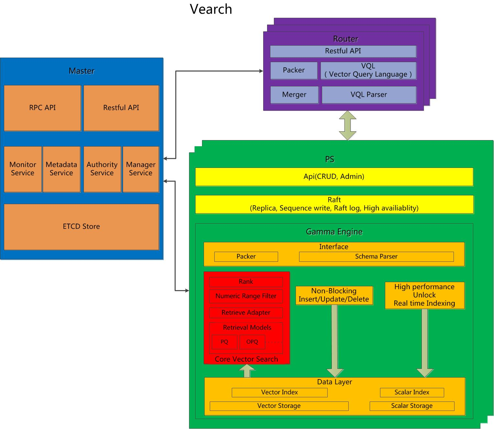

Summary
========

Vearch is a scalable distributed system for efficient similarity search of deep learning vectors.

Basic Concepts
-----------------------
Cluster: Vearch cluster usually includes several nodes, which are divided into distributed cluster and stand-alone.

Node: Vearch includes three types of nodes, master node (metadata management node), router node (routing computing node), and partition server node (data storage and computing node).

db: Similar to a database, the db will be created first in the cluster.

Space: Similar to a database table, the library contains several tables.

Partition: Usually each table contains several data fragments. Each data fragment only contains part of the data of the table, corresponding to partition_num.

Replica: Each data shard can have multiple replicas to ensure high availability and improve cluster performance (such as QPS, etc.), corresponding to replica_num.

Document: The basic data unit of the table. Each document usually contains several fields. Generally speaking, the document contains at least one vector field.

Field: The basic data unit of the document, including vector fields and scalar fields (numeric types integer, long, float, double and string type string).

Vector index: Use vector index to accelerate queries, so the index attribute must be set to true for vector fields.

Scalar index: Retrieve scalar fields. If you want to query a certain field, you must set the corresponding field index attribute to true.

Overall Architecture
-----------------------

Data Model: space, documents, vectors, scalars

Components: Master，Routerm，PartitionServer。

Master: Responsible for schema mananagement, cluster-level metadata, and resource coordination.

Router: Provides RESTful API: create , delete search and update ; request routing, and result merging.

PartitionServer(PS): Hosts document partitions with raft-based replication. Gamma is the core vector search engine. It provides the ability of storing, indexing and retrieving the vectors and scalars.

General Introduction
-----------------------

1. Supports both CPU and GPU versions.

2. Support adding data to the index in real time.

3. Supports the definition of multiple vector fields in a single document, and batch operations of adding and searching.

4. Supports numerical field range filtering and string field label filtering, and supports vector and scalar mixed retrieval.

5. Supports IVFPQ, HNSW, binary and other indexing methods.

6. Support Python SDK local rapid development verification.

7. Support machine learning algorithm plug-ins to facilitate system deployment and use.

System Features
-----------------------
1. Self-developed gamma engine provides high-performance vector retrieval.

2. IVFPQ inverted index supports compaction, and retrieval performance is not affected by the number of document updates.

3. Supports two data storage methods: memory and disk, and supports ultra-large data scale.

4. Implement multiple copies of data storage based on the raft protocol.

5. Supports inner product (InnerProduct) and Euclidean distance (L2) methods to calculate vector distance.

